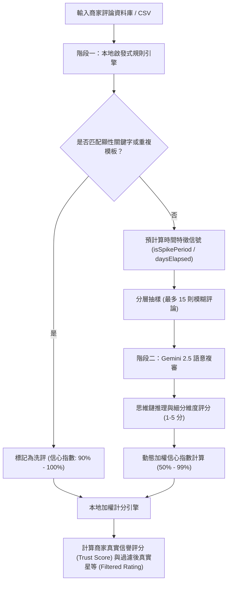

# Google Maps TrueRating 商家評價審計判斷邏輯說明

本系統目前採用**「兩階段混合式雙重審計流水線（Two-Stage Hybrid Audit Pipeline）」**來判斷 Google Maps 評論是否為「洗評（Washed）」或「真實口碑（Clean）」。以下為詳細判斷邏輯、時間特徵指標與數學加權公式。

---

## 1. 系統架構簡介

---

## 2. 階段一：本地啟發式規則引擎 (Stage 1: Local Heuristics)

此階段直接在本機瀏覽器執行，特徵匹配速度快，能瞬間過濾出最顯著的惡意洗評與打卡洗評。

### 2.1 顯性利益交換與贈送關鍵字匹配 (Explicit Bribe & Promo Send)
匹配是否含有商家常用的打卡促銷交易關鍵字，分為以下兩類檢測：
1. **直接關鍵字匹配**：包含特定組合關鍵字，如 `打卡`、`活動`、`評論送`、`打卡送`、`好評送`、`免費送`、`送小菜`、`送起司球`、`送飲料`、`送肉`、`送單點`、`送麻糬`、`送奶酪`。
2. **條件式贈送特徵匹配（避免誤判服務性「送」字）**：
   * **條件 A**：評論中出現 `送` 字，且排除常規送餐與服務性詞彙（如 `外送`、`配送`、`送禮`、`送給`、`送餐`、`送上`、`送來`、`送錯`、`送客`、`送走`、`送出`、`推送`、`面送`、`送速度`、`送口`、`送入`、`送到`、`送達`、`送桌`、`補送`、`送回`、`菜梯送`、`端送`、`發送`、`傳送`、`運送`、`送進`、`送過`、`送風`、`陸續送`）。
   * **條件 B**：同時包含宣傳性語境關鍵字（如 `好評`、`評論`、`分享`、`按讚`、`追蹤`、`關注`、`五星`、`五顆星`、`5星`、`5顆星`、`推薦`、`留言`、`截圖`、`貼文`、`社群`、`IG`、`FB`、`臉書`、`Google`、`google`）。
* **判定結果**：若符合直接關鍵字，或同時滿足條件 A 與條件 B，直接判定 `isWashed: true`、`issueType: 'incentive'`、`信心指數 (confidenceScore): 100%`。

### 2.2 Pairwise 相似度模板檢測 (Template Detection)
為防範刷評工作室使用同一套模版複製貼上：
*   **機制**：將文字去除空白後，擷取每個字元組成 **2-Gram 字符特徵**，對全店評論進行交叉比對。
*   **門檻**：若兩則評論的字數大於 6，且 **Jaccard 相似度 > 75%**：
*   **判定結果**：直接判定 `isWashed: true`、`issueType: 'template'`、`信心指數 (confidenceScore): 90%`。

---

## 3. 輔助特徵：時間特徵信號預計算 (Temporal Signals)

在進入第二階段前，本機引擎會預先為每則評論計算兩個時間特徵，作為脈絡資訊傳遞給 Gemini AI：

1.  **歷史相對時間 (`daysElapsed`)**：
    計算評論發表至今所經歷的天數。協助 AI 理解此評論屬於歷史行為還是近期行為。
2.  **時間密度暴增特徵 (`isSpikePeriod`)**：
    統計各個月份的評論發布數，若某月份評論數大於**「歷史月平均數的 2 倍」**且該月**評論數 $\ge 10$ 則**，則該月發布的所有評論皆標記 `isSpikePeriod: true`。這代表此評論極可能發布於商家的打卡宣傳期或洗評集中期。

---

## 4. 階段二：Gemini 2.5 雲端語意複審 (Stage 2: Gemini Cloud Audit)

針對階段一未被匹配，但星等為 5 星且有文字描述的「模糊 / 高風險評論」進行分層抽樣（最多抽樣 15 則），送交 Gemini 進行語意分析。

### 4.1 思維鏈模式 (Chain-of-Thought, CoT)
Gemini 被強制作答輸出 `reasoningPath` 欄位，在給出結論前必須一步步推導以下要素：
*   評論字數與情感是否誇張、敷衍、空洞？
*   是否包含具體的餐點、環境特色或排隊客觀感受？
*   結合 `isSpikePeriod`（是否在暴增期）與 `daysElapsed`（歷史時間）綜合研判。

### 4.2 指標評分細分化 (1 - 5 分)
Gemini 針對三個獨立維度進行打分：
*   **利益交換強度 (`incentiveIntensity`, $I$)**：是否有為獲得折扣/贈禮而寫的好評痕跡（1 分最弱，5 分最強）。
*   **情感真實度 (`sentimentAuthenticity`, $A$)**：情感表達是否真誠自然（1 分最假，5 分最真）。
*   **描述細緻度 (`descriptionGranularity`, $D$)**：對餐點、服務、細節描述的具體程度（1 分最空洞，5 分最細緻）。

### 4.3 對稱指標加權信心指數 (Symmetric Confidence Score)
本機接收到評分後，根據以下公式動態計算該則評論的信心指數：

1.  **計算偏差總分 (Score Deviation)**：
    $$S_{val} = (I - 1) + (5 - A) + (5 - D)$$
    *(洗評特徵越重，$S_{val}$ 分數越高，範圍為 0 到 12 分。)*

2.  **動態信心指數計算**：
    *   **若 AI 判定此評論為洗評 (`isWashed = true`)**：
        $$Confidence\% = 50 + \left( \frac{S_{val}}{12} \times 49 \right)$$
        *(洗評特徵越強，AI 判定為洗評的信心越高，範圍在 50% ~ 99% 之間)*
    *   **若 AI 判定此評論為真實 (`isWashed = false`)**：
        $$Confidence\% = 99 - \left( \frac{S_{val}}{12} \times 49 \right)$$
        *(洗評特徵越弱，AI 判定為真實的信心越高，範圍在 50% ~ 99% 之間)*

---

## 5. 最終統計：商家信譽與過濾星等計算 (Aggregates)

系統拒絕使用非黑即白的二分法裁決，而是以**信心指數轉化為權重**進行軟性篩選 (Soft-filtering)：

*   **評論權重公式 (Weight)**：
    *   若判定為洗評 (`isWashed = true`)：
        $$Weight = 1 - \frac{Confidence}{100}$$
    *   若判定為真實 (`isWashed = false`)：
        $$Weight = \frac{Confidence}{100}$$
    *(例如：一則被 99% 信心判定為洗評的評論，其評分權重僅佔 1%，接近被完全過濾)*

*   **商家真實信譽評分 (Trust Score)**：
    $$Trust\ Score = \left( \frac{\sum Weight}{Total\ Reviews} \right) \times 100\%$$

*   **過濾後之真實星等 (Filtered Rating)**：
    $$Filtered\ Rating = \frac{\sum (Stars \times Weight)}{\sum Weight}$$
